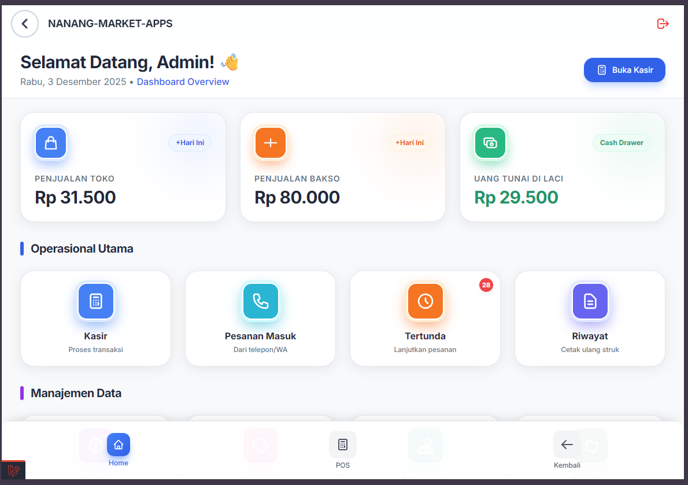

# NanangStore POS System

Aplikasi Point of Sale (POS) modern yang dirancang untuk efisiensi tinggi, mendukung berbagai perangkat (PC, Tablet, HP), dan dioptimalkan untuk penggunaan cepat dengan keyboard maupun layar sentuh.

## 🚀 Fitur Utama

### 1. Dashboard & Analisis
*   **Ringkasan Penjualan**: Pantau omzet harian Toko Nanang dan Bakso secara real-time.
*   **Quick Actions**: Akses cepat ke menu penting (Kasir, Laporan, Stok, dll).
*   **Grafik & Statistik**: Visualisasi data penjualan untuk pengambilan keputusan.

### 2. Point of Sale (Kasir)

*   **Multi-Device Support**: Tampilan responsif yang menyesuaikan otomatis dengan layar PC, Tablet, atau HP.
*   **Mode Scanner (F3)**: Dukungan penuh untuk barcode scanner. Tekan `F3` untuk toggle mode scanner.
*   **Pencarian Cepat**: Cari produk berdasarkan nama atau kode dengan cepat.
*   **Kategori Pintar**:
    *   **Pinned Categories**: Akses instan ke kategori utama ("Giling Bakso", "Toko Nanang").
    *   **Sering Dibeli**: Rekomendasi otomatis berdasarkan riwayat pelanggan.
*   **Keranjang Belanja**: Kelola item, ubah kuantitas, dan hapus item dengan mudah.
*   **Diskon & Pajak**: Dukungan untuk diskon manual dan perhitungan pajak otomatis.
*   **Hold/Pending Transaksi**: Simpan transaksi sementara dan lanjutkan nanti.
*   **Cetak Struk**: Cetak struk belanja langsung ke printer thermal atau kirim via WhatsApp.

### 3. Laporan Lengkap
*   **Laporan Transaksi**: Detail setiap transaksi dengan filter tanggal dan status.
*   **Laporan Harian**: Rekapitulasi penjualan harian per produk.
*   **Laporan Stok**: Pantau pergerakan stok masuk dan keluar.
*   **Laporan Keuangan**: Laporan laba rugi sederhana.

### 4. Manajemen Data
*   **Produk**: Tambah, edit, hapus produk, atur harga (ecer/grosir), dan stok.
*   **Pelanggan**: Database pelanggan dengan riwayat hutang dan pembelian.
*   **Stok Opname**: Fitur untuk penyesuaian stok fisik dan sistem.

---

## 🖥️ Kompatibilitas Perangkat

Aplikasi ini dibangun dengan teknologi **Responsive Web Design**, sehingga dapat berjalan optimal di:

*   **PC / Laptop / Monitor Besar**:
    *   Tampilan penuh dengan grid produk yang luas.
    *   Dioptimalkan untuk penggunaan Mouse & Keyboard.
    *   Cocok untuk kasir utama.
*   **Tablet (iPad / Android Tab)**:
    *   Tampilan touch-friendly dengan tombol yang mudah ditekan.
    *   Layout adaptif (Landscape/Portrait).
*   **HP / Smartphone**:
    *   Tampilan mobile-first yang ringkas.
    *   Navigasi bawah (Bottom Navigation) untuk kemudahan akses satu tangan.
    *   Menu sidebar tersembunyi untuk memaksimalkan ruang layar.

---

## ⌨️ Shortcut Keyboard (Tanpa Mouse)

Untuk mempercepat operasional kasir, gunakan tombol pintas berikut:

| Tombol | Fungsi | Keterangan |
| :--- | :--- | :--- |
| **F3** | **Mode Scanner** | Mengaktifkan/menonaktifkan input khusus scanner barcode. Saat aktif, input manual dimatikan untuk mencegah error. |
| **Enter** | **Cari / Tambah** | Tekan Enter di kolom pencarian untuk mencari produk atau menambah produk terpilih ke keranjang. |
| **Panah Kanan/Kiri** | **Navigasi Produk** | Pindah pilihan produk di hasil pencarian (saat menggunakan keyboard). |
| **Esc** | **Batal / Tutup** | Menutup modal atau membatalkan pencarian. |

---

## 📖 Panduan Penggunaan Singkat

### Memulai Transaksi (Kasir)
1.  Buka menu **Kasir Bersama** atau klik ikon POS di navigasi bawah.
2.  **Scan Barcode**: Pastikan mode scanner aktif (tekan F3), lalu scan barang.
3.  **Cari Manual**: Ketik nama barang di kolom pencarian, pilih barang, atur jumlah, klik **Simpan**.
4.  **Checkout**: Klik tombol **Bayar** (atau ikon keranjang di HP), pilih metode pembayaran, masukkan nominal, dan proses transaksi.

### Mengelola Stok
1.  Masuk ke menu **Stok Opname** atau **Produk**.
2.  Lakukan penyesuaian stok jika ada selisih.
3.  Gunakan **Goods Receipt** untuk mencatat barang masuk dari supplier.

### Laporan
1.  Akses menu **Laporan & Analisis** di Dashboard.
2.  Pilih jenis laporan (Transaksi, Harian, dll).
3.  Gunakan filter tanggal untuk melihat data periode tertentu.

---

## 🛠️ Instalasi & Teknis

**Persyaratan Sistem:**
*   PHP 8.3+
*   Composer
*   Node.js & NPM
*   Database MySQL/MariaDB

**Cara Install:**
1.  Clone repository.
2.  Jalankan `composer install`.
3.  Jalankan `npm install && npm run build`.
4.  Copy `.env.example` ke `.env` dan atur database.
5.  Jalankan `php artisan key:generate`.
6.  pindahaka database/finish ke migrations
7.  Jalankan `php artisan migrate --seed`.
8.  Akses aplikasi di browser.

---

*Dibuat dengan ❤️ untuk NanangStore.*
